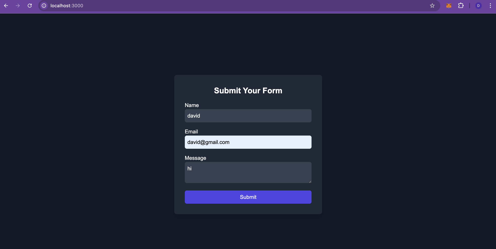

# Form Submission Frontend

This project is a simple Next.js frontend for submitting a form to a FastAPI backend. The form captures a user's name, email, and message, then sends the data to the backend for processing using gRPC.

## Table of Contents

- [Getting Started](#getting-started)
  - [Prerequisites](#prerequisites)
  - [Installation](#installation)
- [Technologies Used](#technologies-used)
- [Project Structure](#project-structure)
- [Features](#features)
- [Running the Frontend](#running-the-frontend)
- [Submitting the Form](#submitting-the-form)
- [Screenshots](#screenshots)
- [Example Usage](#example-usage)
- [License](#license)

## Getting Started

To get the frontend up and running locally, follow these steps:

### Prerequisites

- Node.js (v18 or higher)
- npm (which comes with Node.js)

If you don't have Node.js installed, you can install it via Homebrew:

```bash
brew install node@18
```

### Installation

Clone this repository to your local machine:

```bash
git clone https://github.com/yourusername/formapplication-frontend.git
cd formapplication/frontend
```

Install the project dependencies:

```bash
npm install
```

Create a `.env.local` file in the root directory and add the following environment variable for your backend URL:

```bash
NEXT_PUBLIC_BACKEND_URL=http://localhost:8000
```

Start the development server:

```bash
npm run dev
```

The application will be running at [http://localhost:3000](http://localhost:3000).

## Technologies Used

- **Next.js**: React framework for server-rendered applications
- **React Hook Form**: For form handling and validation
- **TypeScript**: For type-safe code
- **TailwindCSS**: For styling the frontend
- **Zod**: For schema validation

## Project Structure

```
frontend
├── components
│   └── SubmitForm.tsx     # The form component for submitting data
├── pages
│   └── index.tsx          # The main entry point for the app
├── public                 # Static assets
├── styles                 # Global CSS files
├── package.json           # Project dependencies and scripts
└── next.config.js         # Next.js configuration
```

## Features

- A simple form to collect the user's name, email, and message.
- The form is validated using React Hook Form and Zod.
- TailwindCSS is used for easy, responsive styling.
- The form submits data to a FastAPI backend that processes the form data using gRPC.

## Running the Frontend

Once you have the project dependencies installed, you can start the development server using the following command:

```bash
npm run dev
```

This will start the application on [http://localhost:3000](http://localhost:3000).

## Submitting the Form

The form consists of three fields:

- **Name**: Required.
- **Email**: Required, validated against an email pattern.
- **Message**: Required.

Upon form submission:

- The form data is sent as a POST request to the FastAPI backend running on `http://localhost:8000/submit-form`.
- The backend processes the form data using gRPC.
- If the form is successfully processed, you will see a success message.

## Screenshots

Here's a sample screenshot of the form:



## Example Usage

Once the form is submitted, the data will be processed by the backend, and the frontend will display a success or failure message depending on the result.

## License

This project is licensed under the MIT License. See the [LICENSE](LICENSE) file for details.